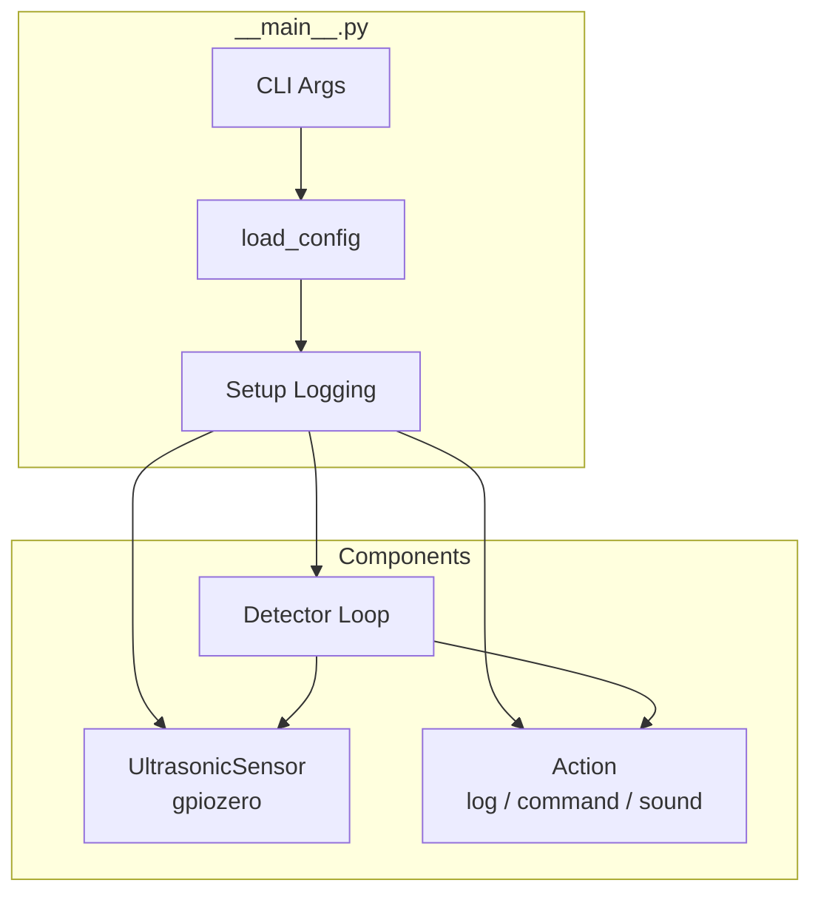
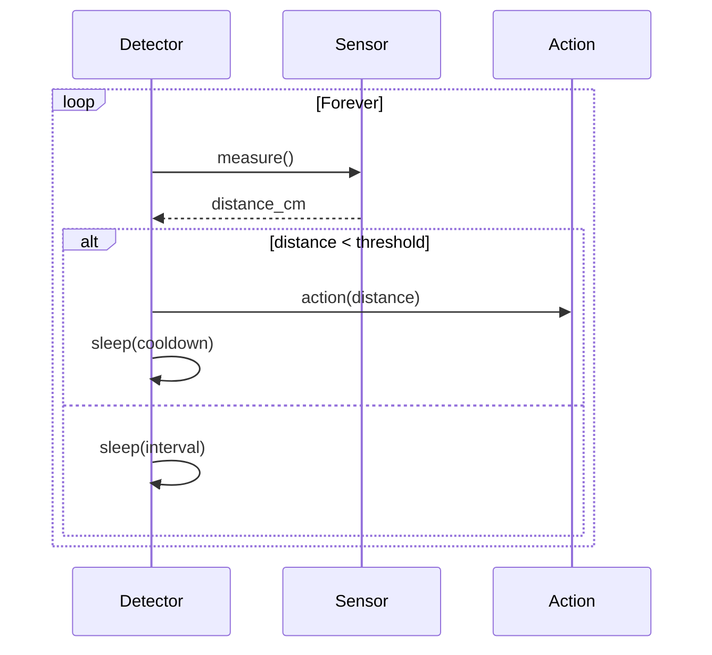

# Architecture

## Design Pattern

Single-process polling loop. Sensor abstracted via gpiozero, actions are pluggable callables.

## System Architecture

## Detection Loop

## Key Design Decisions

- **gpiozero.DistanceSensor** — handles ultrasonic timing internally, returns meters (converted to cm)
- **Pluggable actions** — factory function returns callable based on config
- **Lazy pygame import** — only imported if action="sound"
- **`float('inf')` on error** — measurement failures don't trigger false detections
