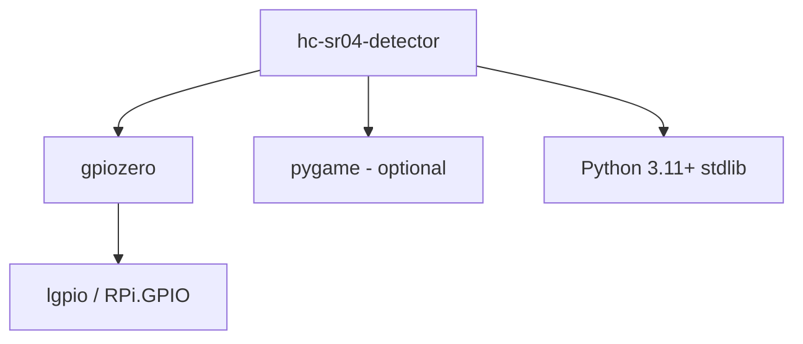

# Dependencies

## Runtime

| Package | Purpose | Used By |
|---------|---------|---------|
| `gpiozero` | HC-SR04 distance measurement | `sensor.py` |
| `pygame` (optional) | Sound playback for sound action | `actions.py` |

## Standard Library

| Module | Purpose |
|--------|---------|
| `tomllib` | Config parsing |
| `argparse` | CLI |
| `logging` | Structured logging |
| `subprocess` | Command action execution |
| `time` | Sleep/polling |
| `dataclasses` | Config structure |
| `pathlib` | Path handling |

## System Requirements

| Requirement | Notes |
|-------------|-------|
| Raspberry Pi | Any model with GPIO |
| HC-SR04 sensor | With voltage divider on echo pin |
| User in `gpio` group | Permission for GPIO access |

## Dependency Graph

