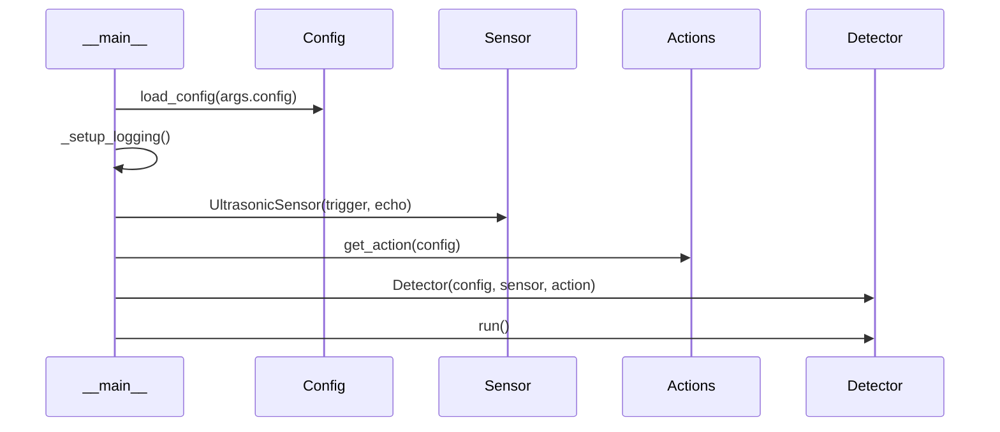

# Workflows

## Startup

## Detection Cycle

1. `sensor.measure()` → distance in cm
2. If distance < threshold → call `action(distance)` → sleep(cooldown)
3. If distance ≥ threshold → sleep(interval)
4. Repeat

## Shutdown

`KeyboardInterrupt` → `detector.shutdown()` → `sensor.close()`
