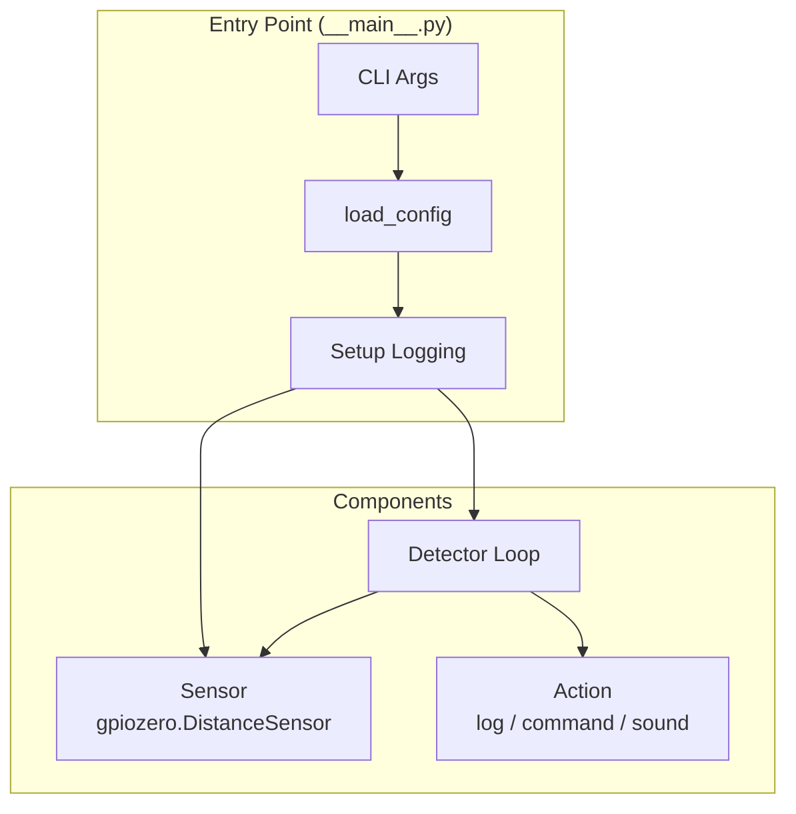
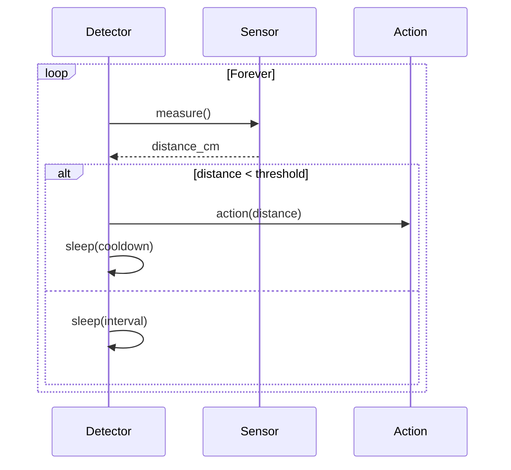

# System Design — HC-SR04 Motion Detector Modernization

## Architecture Overview

Single-process application with a polling loop. Distance measurement via `gpiozero.DistanceSensor`, configurable actions on detection.



## Module Structure

```
hc_sr04_motion_detector/
├── __init__.py          # Package version
├── __main__.py          # Entry point
├── config.py            # Config dataclass + TOML loading
├── sensor.py            # DistanceSensor wrapper
├── detector.py          # Detection loop
└── actions.py           # Pluggable detection actions
```

## Component Design

### Config (`config.py`)

```python
@dataclass
class Config:
    trigger_pin: int = 23
    echo_pin: int = 24
    distance_threshold_cm: float = 30.0
    cooldown_seconds: float = 2.0
    measurement_interval: float = 0.5
    action: str = "log"                    # "log", "command", "sound"
    action_command: str | None = None      # Shell command for "command" action
    action_sound: Path | None = None       # Sound file for "sound" action
    log_level: str = "INFO"
```

### Sensor (`sensor.py`)

```python
class UltrasonicSensor:
    def __init__(self, trigger_pin: int, echo_pin: int) -> None: ...
    def measure(self) -> float: ...        # Returns distance in cm
    def close(self) -> None: ...
```

- Wraps `gpiozero.DistanceSensor`
- `measure()` returns `sensor.distance * 100` (gpiozero returns meters)
- Catches errors and returns `float('inf')` on failure

### Actions (`actions.py`)

```python
def get_action(config: Config) -> Callable[[float], None]:
    """Return the appropriate action function based on config."""
    ...

def log_action(distance: float) -> None: ...
def command_action(command: str, distance: float) -> None: ...
def sound_action(sound_path: Path, distance: float) -> None: ...
```

### Detector (`detector.py`)

```python
class Detector:
    def __init__(self, config: Config, sensor: UltrasonicSensor, action: Callable) -> None: ...
    def run(self) -> None: ...
    def shutdown(self) -> None: ...
```

- `run()`: measure → compare threshold → trigger action → cooldown → repeat
- `shutdown()`: close sensor

### Entry Point (`__main__.py`)

```python
def main() -> None:
    config = load_config(parse_args())
    setup_logging(config.log_level)
    sensor = UltrasonicSensor(config.trigger_pin, config.echo_pin)
    action = get_action(config)
    detector = Detector(config, sensor, action)
    try:
        detector.run()
    except KeyboardInterrupt:
        detector.shutdown()
```

## Detection Loop



## Configuration File Format

```toml
[sensor]
trigger_pin = 23
echo_pin = 24

[detection]
distance_threshold_cm = 30.0
cooldown_seconds = 2.0
measurement_interval = 0.5

[action]
type = "log"                    # "log", "command", "sound"
# command = "echo 'detected!'"
# sound = "/path/to/alert.mp3"

[app]
log_level = "INFO"
```

## Technology Stack

| Component | Library |
|-----------|---------|
| Distance sensor | `gpiozero` (DistanceSensor) |
| Sound playback | `pygame` (optional, only if action=sound) |
| Config | `tomllib` (stdlib) |
| CLI | `argparse` (stdlib) |
| Logging | `logging` (stdlib) |
| Build | hatchling |
| Testing | pytest, pytest-cov, pytest-mock |

## Error Handling

| Scenario | Behavior |
|----------|----------|
| Sensor init failure | CRITICAL, exit |
| Invalid reading | WARNING, skip iteration |
| Invalid config | ERROR, exit |
| Command action fails | WARNING, continue loop |
| Sound file missing | WARNING at startup, skip sound |
